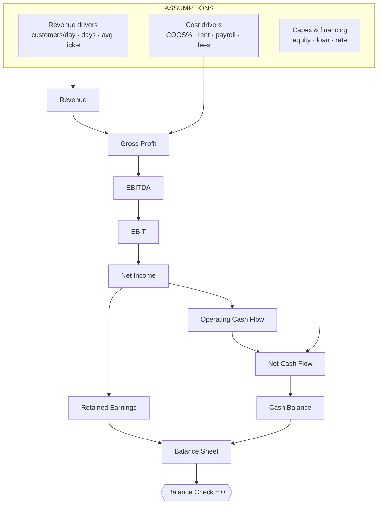

# ☕ Coffee Shop NYC — Business Plan

> A 3-year business plan for an independent specialty café in Manhattan. Funds a build-out with owner equity + a bank loan, then ramps traffic and ticket. P&L, Cash Flow and Balance Sheet that tie out, plus a CFO-style dashboard.

  

&nbsp;

---

## What it's for

An independent specialty coffee shop, funded in 2026 with **$150k equity + a $200k loan**, spending **$250k** on the build-out. From a handful of drivers (customers/day, operating days, average ticket), it produces a complete, balanced set of statements and a CFO dashboard, ready to hand to a founder or a lender.

---

## Dashboard — 2028 at a glance

| Revenue | EBITDA margin | Net income | Cash (EoP) |
|:--:|:--:|:--:|:--:|
| **$1,094,400** | **27%** | **$186,725** | **$457,226** |

<!-- Replace with a real screenshot of the Layerz CFO dashboard (export) placed in .github/assets/ -->

*The Layerz CFO dashboard, exported. Revenue ramp, margin bridge and cash runway, live-recomputed from the drivers.*

---

## P&L (USD)

| | 2026 | 2027 | 2028 |
|---|--:|--:|--:|
| Revenue | 675,000 | 892,800 | 1,094,400 |
| Cost of Goods Sold | (216,000) | (267,840) | (317,376) |
| **Gross Profit** | **459,000** | **624,960** | **777,024** |
| Gross Margin % | 68% | 70% | 71% |
| Operating Expenses | (371,875) | (428,320) | (477,360) |
| **EBITDA** | **87,125** | **196,640** | **299,664** |
| EBITDA Margin % | 13% | 22% | 27% |
| Depreciation | (35,714) | (37,143) | (38,857) |
| EBIT | 51,411 | 159,497 | 260,807 |
| Interest Expense | 0 | (14,000) | (11,840) |
| Pre-Tax Income | 51,411 | 145,497 | 248,967 |
| Income Tax | (12,853) | (36,374) | (62,242) |
| **Net Income** | **38,558** | **109,123** | **186,725** |
| Net Margin % | 6% | 12% | 17% |

## Cash & balance (USD)

| | 2026 | 2027 | 2028 |
|---|--:|--:|--:|
| Operating Cash Flow | 83,872 | 148,570 | 227,784 |
| Net Cash Flow | 158,872 | 111,570 | 186,784 |
| Cash Balance (EoP) | 158,872 | 270,442 | 457,226 |
| **Balance Check** | **0** | **0** | **0** |

---

## How it's wired

88 items across 4 sections (Assumptions · P&L · Cash Flow · Balance Sheet), monitored so **Assets − Liabilities − Equity = 0** every year.

---

## Conventions

- **Currency:** USD, displayed `$0,0`
- **Periodicity:** yearly, 2026–2028
- **Sign convention:** `expenses_negative` — revenues positive; costs, taxes, depreciation and interest stored **negative**, so every subtotal is a plain SUM (Gross Profit = Revenue + COGS, EBITDA = Gross Profit + Total OpEx…).

---

## How to use it

1. **[Open in Layerz](https://app.layerz.cc/models/d161c3c4-ade6-48e4-b162-48fa2f81c545)** and fork it (free account).
2. Edit the drivers in **Assumptions** — customers/day, avg ticket, rent, loan terms.
3. Watch every statement recompute, and confirm **Balance Check == 0**.

> Known simplifications: flat 360 operating days, blended ticket, COGS a flat % of revenue, single loaded payroll line. Stress the ramp before any lending use.

---

*Shared by [@anthomakr](https://github.com/anthomakr) · built with [Layerz](https://layerz.cc) · we share the recipe, not the black box.*
