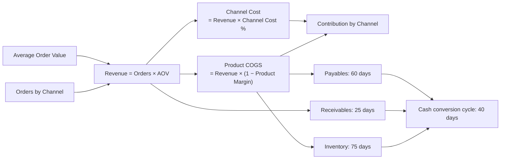

# 🛒 E-commerce & Retail - Channel Mix

> Four channels, four different economics. A blended gross margin hides which one actually pays, and hides what growth costs you in cash.

  

A fork-and-adapt base for **any product business selling through more than one channel**. The worked example is an omnichannel consumer brand going from €18.4M to €34.0M of net revenue across DTC, marketplaces, own stores and wholesale.

---

## The line that decides everything

| Channel | Product margin | Channel cost | **Contribution margin** |
|---|--:|--:|--:|
| DTC Website | 62% | 12% | **50%** |
| Own Retail | 60% | 18% | **42%** |
| Marketplaces | 58% | 22% | **36%** |
| Wholesale | 38% | 3% | **35%** |

Product margin is margin on product cost alone. Channel cost is what it takes to serve that channel: payment and shipping for DTC, commission and fulfilment for marketplaces, store staff and rent for retail.

**Marketplaces are the second-largest channel by revenue and the second-least profitable per euro.** On a blended gross margin, that is invisible.

## Revenue and contribution by channel (€)

| Channel | Revenue 2026 | Mix | Contribution 2026 | Revenue 2028 | Mix | Contribution 2028 |
|---|--:|--:|--:|--:|--:|--:|
| DTC Website | 8,160,000 | 44.3% | 4,080,000 | 15,480,000 | 45.6% | 7,740,000 |
| Marketplaces | 4,680,000 | 25.4% | 1,684,800 | 9,450,000 | 27.8% | 3,402,000 |
| Wholesale | 2,880,000 | 15.6% | 1,008,000 | 5,100,000 | 15.0% | 1,785,000 |
| Own Retail | 2,700,000 | 14.7% | 1,134,000 | 3,948,000 | 11.6% | 1,658,160 |
| **Total** | **18,420,000** | | **7,906,800** | **33,978,000** | | **14,585,160** |

**To add a channel, add one element to the `Channels` list and fill its four cells.** Revenue, COGS, channel cost, contribution and the mix all extend on their own.

## P&L (€)

| Line | 2026 | 2027 | 2028 |
|---|--:|--:|--:|
| Net revenue | 18,420,000 | 25,712,000 | 33,978,000 |
| Product COGS | (7,932,000) | (11,062,800) | (14,592,600) |
| **Gross profit** | **10,488,000** | **14,649,200** | **19,385,400** |
| Channel costs | (2,581,200) | (3,616,760) | (4,800,240) |
| **Contribution** | **7,906,800** | **11,032,440** | **14,585,160** |
| Marketing | (3,200,000) | (4,100,000) | (5,100,000) |
| Overheads (G&A, warehouse, tech) | (3,600,000) | (4,200,000) | (4,900,000) |
| **EBITDA** | **1,106,800** | **2,732,440** | **4,585,160** |
| D&A | (171,429) | (300,000) | (442,857) |
| Interest | (150,000) | (150,000) | (126,000) |
| Income tax | (196,343) | (570,610) | (1,004,076) |
| **Net income** | **589,029** | **1,711,830** | **3,012,227** |

Contribution sits **above** marketing on purpose. Channel economics are a structural choice, marketing is a discretionary one, and mixing them makes both unreadable.

## Retail metrics

| Metric | 2026 | 2027 | 2028 |
|---|--:|--:|--:|
| Gross margin | 56.9% | 57.0% | 57.1% |
| Contribution margin | 42.9% | 42.9% | 42.9% |
| Marketing as % of revenue | 17.4% | 15.9% | 15.0% |
| EBITDA margin | 6.0% | 10.6% | 13.5% |
| Inventory turns | 4.9x | 4.9x | 4.9x |
| Cash conversion cycle | 40 days | 40 days | 40 days |

---

## Cash conversion is the second story

This is an inventory business, so working capital runs the opposite way from a services firm: **75 days of inventory + 25 days DSO − 60 days payables = a 40-day cash conversion cycle**. Every euro of growth ties up 40 days of cash before it comes back.

| Line | 2026 | 2027 | 2028 |
|---|--:|--:|--:|
| Inventory | 1,629,863 | 2,273,178 | 2,998,479 |
| Receivables | 1,261,644 | 1,761,096 | 2,327,260 |
| **Operating cash flow** | **(827,159)** | **1,383,715** | **2,743,860** |
| Cash | 2,472,841 | 2,556,556 | 3,900,415 |

**Year 1 shows €1.1M of EBITDA and −€0.8M of operating cash flow**, because inventory and receivables absorb €2.9M as the business scales. It recovers from 2027. This is why profitable retailers still run out of money.

## Balance sheet

| | 2026 | 2027 | 2028 |
|---|--:|--:|--:|
| Total assets | 6,392,919 | 8,219,401 | 11,411,869 |
| Total liabilities | 3,803,890 | 3,918,542 | 4,098,784 |
| Total equity | 2,589,029 | 4,300,859 | 7,313,086 |
| **Balance check** | **0** | **0** | **0** |

## Conventions

- **Currency**: EUR. **Sign**: revenues positive, all costs negative, so subtotals are simple sums. The `by Channel` cost lines are stored positive and negated by their P&L line.
- **Orders** means consumer orders for DTC, marketplaces and retail, and purchase orders for wholesale. Hence the very different scale between channels.

## Known simplifications

Retail store costs sit inside `Channel Cost %` rather than being driven by a store count and a rent roll. No returns or discount lines, so work in net revenue. No repeat-purchase or cohort logic on DTC: if retention is your question, pair this with the [SaaS Cohort](../saas-cohort/) engine. One inventory pool at a single days figure, no SKU or seasonality. Marketing is a spend line, not a CAC × new-customer build.

## How to use it

1. **[Open it in Layerz](https://app.layerz.cc/models/d5e899c7-a710-4f2a-9b05-cc3e88690af1)** (free account) and **fork** it.
2. Replace the `Channels` list with your own, then fill orders, AOV, product margin and channel cost.
3. Re-base days inventory, DSO and DPO on your real terms. They drive the cash line far more than the P&L does.
4. Export to Excel any time. The export is clean and auditable.

---

*Part of [Finance Models](../../README.md). Built with [Layerz](https://layerz.cc). We share the recipe, not the black box.*
