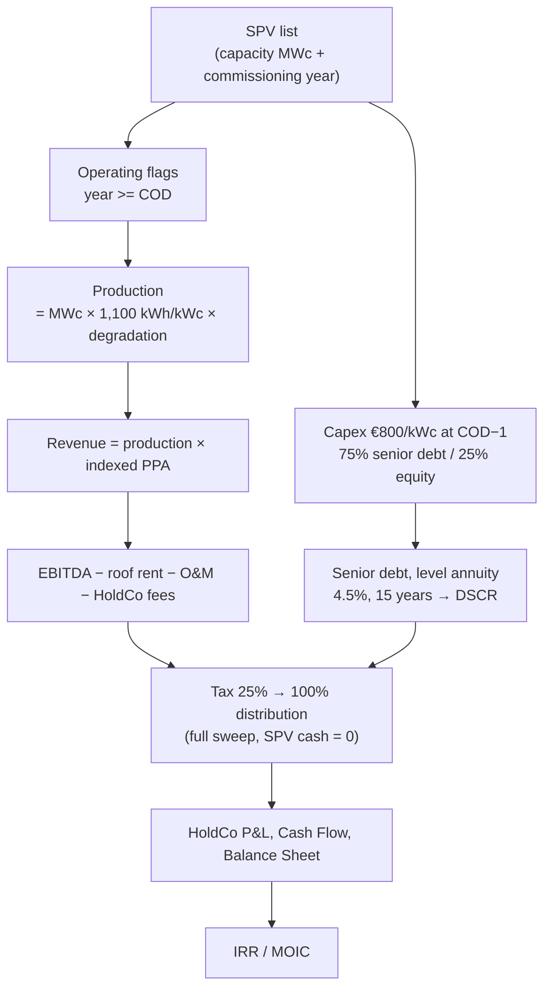

# ☀️ HoldCo / SPV Portfolio - Rooftop Solar

> A portfolio of project companies under one holding, driven entirely by a list. Adding a fourth SPV is three keystrokes: a list element, a capacity, a commissioning year. No formula is touched.

  

-555)

Three rooftop solar SPVs (1.5, 2.5 and 4.0 MWc, commissioned 2027, 2028 and 2029) held under a HoldCo. Senior amortising debt at SPV level, full cash sweep up to the holding, HoldCo balance sheet that ties out, investor IRR and MOIC. **No client data**: every figure is a generic default.

> **A note on language.** The model's own labels and guide are in French, because the structure is French: rooftop PPA tariffs, the *régime mère-fille* participation-exemption on dividends. Translating it would break the thing it is useful for. The numbers, structure and Excel export are language-neutral.

---

## Portfolio results

| | 2028 | 2032 | 2035 | 2040 | 2045 |
|---|--:|--:|--:|--:|--:|
| Installed capacity (MWc) | 4.0 | 8.0 | 8.0 | 8.0 | 8.0 |
| Consolidated revenue (k€) | 498 | 1,039 | 1,070 | 1,125 | 1,181 |
| Consolidated EBITDA (k€) | 371 | 769 | 788 | 820 | 853 |
| Portfolio DSCR | 1.66x | 1.72x | 1.76x | 1.83x | n/a |

DSCR reads n/a in 2045 because the senior debt is fully repaid in 2043. Peak debt is €4,639k in 2028.

## Investor returns

| | 2028 | 2032 | 2035 | 2040 | 2045 |
|---|--:|--:|--:|--:|--:|
| Cumulative capital called (k€) | 1,659 | 1,659 | 1,659 | 1,659 | 1,659 |
| Cumulative dividends (k€) | 0 | 766 | 1,350 | 2,315 | 4,440 |
| **MOIC** | 0.00x | 0.46x | 0.81x | 1.40x | **2.68x** |

**Investor IRR: 10%.** No terminal value: the residual value of the rooftop assets at the end of 2045 is deliberately not credited, so the return stands on distributions alone.

---

## The list is the structure

Every line in the SPV section runs in **list mode**: each formula evaluates per element with `[i]`, and a bare reference returns the portfolio total. The consolidation and the HoldCo read those aggregates.

**Adding an SPV is three gestures and zero formulas**: add an element to the `SPV` list, enter its capacity and its commissioning year. Production, debt, tax, distributions, consolidation and the HoldCo balance sheet all follow. Shifting a commissioning year re-phases the entire chain.

## How the two levels connect

**SPV level** — production from capacity, degradation at 0.5% per year, revenue at an indexed PPA tariff (€110/MWh, +1.5%/yr), EBITDA after roof rent (10% of revenue), O&M (€15/kWc indexed) and HoldCo management fees (3% of revenue). Capex of €800/kWc is spent the year before commissioning, funded 75% by senior debt and 25% by HoldCo equity. Corporate tax at 25% on EBITDA less straight-line depreciation and interest, then **100% of available cash is distributed**.

**HoldCo level** — management fees plus SPV dividends, less €80k of annual running costs, taxed under the **participation-exemption regime** (5% of dividends taxable). Capital called is computed to keep HoldCo cash at or above zero. The standalone HoldCo balance sheet carries investments at cost plus cash against capital and retained earnings, with a **balance check at 0 across all 20 years, monitored**.

## Conventions

- **Currency**: EUR, in **thousands (k€)**. **Sign**: income and receipts positive, costs and payments negative.
- **Grain**: yearly, 2026 to 2045 (20 financial years).
- Charts point at scalar aggregates, never at a list-mode item, which would unfold.

## Known simplifications

No loss carry-forward on tax, since the SPVs are profitable from year one. No per-SPV balance sheet: with a full sweep, only the HoldCo balance sheet is produced. Capex lands in one go the year before commissioning, with no construction curve and no interest during construction. No debt service reserve account and no DSCR lock-up. A single PPA tariff: for a mix of feed-in, PPA and self-consumption, split the revenue line. Terminal value and liquidation are not modelled.

## How to use it

1. **[Open it in Layerz](https://layerz.cc/models/9548419c-9659-4da0-af74-14d58e61a220)** (free account) and **fork** it.
2. Replace the `SPV` list with your own assets, one element each, with capacity and commissioning year.
3. Re-base the technical and tariff assumptions, then the debt terms. Check DSCR per SPV and at portfolio level.
4. Confirm the HoldCo balance check holds at 0, then export to Excel.

---

*Part of [Finance Models](../../README.md). Built with [Layerz](https://layerz.cc). We share the recipe, not the black box.*
