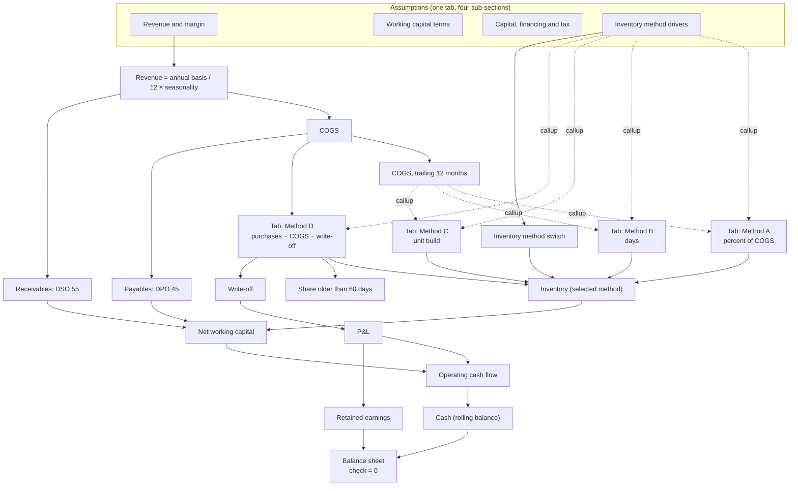

# 📦 Inventory Modelling: Four Methods

> Percent of COGS, days, unit build, and ageing from flows. The same business modelled four ways at once, monthly, with one switch deciding which one drives the balance sheet.

<p align="center">
  <a href="https://layerz.cc/models/74926877-04cc-46f7-b2e8-82bac6589c1f">
    
  </a>
</p>

[](https://layerz.cc/models/74926877-04cc-46f7-b2e8-82bac6589c1f)


Inventory is the line most models decide in ten minutes and never revisit. This one makes that decision the subject: a products business going from €40.0M to €64.6M of revenue, with four inventory methods computed side by side on every one of the 72 months.

**Monthly on purpose.** Three of the four methods give the same answer on flat annual flows. Only a monthly grain with real seasonality lets stock ageing exist at all.

---

## The four methods

Each gets **its own tab**, so you can read one recipe without the other three in the way.

| Tab | Formula | The assumption you own |
|---|---|---|
| **A: percent of COGS** | `COGS12 × ratio` | One ratio. Blind to efficiency: its implied DIO never moves. |
| **B: working capital in days** | `COGS12 × DIO / 365` | Days. Benchmarkable and improvable. The standard choice. |
| **C: unit build** | `units on hand × unit cost` | Cover and unit cost. Survives a change in mix or lead time. |
| **D: ageing from flows** | rolling: `+ purchases − COGS − write-off` | Purchase timing and policy. The only one that knows how old the stock is. |

`COGS12` is COGS over the trailing twelve months. Every ratio method reads it rather than a single month, otherwise inventory would swing with the season instead of with the business.

A, B and C **infer the stock from COGS**. D **forecasts the flows and lets the stock follow**, which is why it alone can produce an age profile and a write-off.

**Every driver still lives in one place.** The `Assumptions` tab is the only source of truth, in four sub-sections. Each method tab *mirrors* the drivers it reads through callups, so it stays a self-contained recipe without becoming a second place to edit a number.

## Four answers, same business

Closing inventory in December, on identical revenue, margin and COGS:

| Method | Dec 2025 | Dec 2029 | Implied DIO 2029 |
|---|--:|--:|--:|
| A. Percent of COGS | 4,315,200 | 6,849,537 | 68 |
| B. Inventory days | 4,322,192 | 6,255,285 | 62 |
| C. Unit build | 4,330,667 | 5,984,138 | 59 |
| D. Ageing from flows | 3,509,000 | 6,051,723 | 60 |

A, B and C are calibrated to land within 0.4% of each other in 2025, which is exactly what you do when you set a model up. By 2029 they are **€865,398 apart**. Method A's implied days never move: a fixed ratio has no way to express an efficiency gain, so it silently assumes the business never improves. `Spread A vs B` and `Spread A vs C` are lines of the model, not something left for the reader to work out.

## The ageing method earns its place

Under FIFO the stock left is always the most recent purchases, so age is a subtraction rather than a layer-by-layer simulation:

```
Stock older than 60 days  = MAX(0, inventory − purchases of the last 2 months)
Write-off (over 180 days) = MAX(0, stock before write-off − purchases of the last 6 months)
```

At the default purchase policy (buying 2% more than you sell), here is what happens:

| | Dec 2025 | Dec 2026 | Dec 2027 | Dec 2028 | Dec 2029 |
|---|--:|--:|--:|--:|--:|
| Stock older than 60 days | 551,000 | 640,900 | 801,153 | 1,046,808 | 1,356,476 |
| **Share of stock older than 60 days** | **16%** | **16%** | **17%** | **20%** | **22%** |
| Write-off | 0 | 0 | 0 | 0 | 0 |

**The write-off never fires, and the stock ages anyway.** That is the finding, not a modelling failure: a business turning stock in 60 days never holds anything for 180, so the accounting alarm stays silent for years while a quarter of the warehouse quietly gets old. Raise `Purchase policy factor` from 1.02 to 1.08 and two thirds of the stock is over 60 days with the write-off still at zero.

No ratio method can produce this column. A, B and C derive the stock from COGS, so by construction they cannot know how old it is.

## P&L (€), identical on methods A, B and C

| Line | 2025 | 2026 | 2027 | 2028 | 2029 |
|---|--:|--:|--:|--:|--:|
| Revenue | 40,000,000 | 46,000,000 | 52,440,000 | 58,732,800 | 64,606,080 |
| COGS | (23,200,000) | (26,680,000) | (30,153,000) | (33,477,696) | (36,825,466) |
| **Gross profit** | **16,800,000** | **19,320,000** | **22,287,000** | **25,255,104** | **27,780,614** |
| Opex | (12,000,000) | (13,800,000) | (15,732,000) | (17,619,840) | (19,381,824) |
| **EBITDA** | **4,800,000** | **5,520,000** | **6,555,000** | **7,635,264** | **8,398,790** |
| **Net income** | **2,475,000** | **2,940,000** | **3,641,250** | **4,376,448** | **4,874,093** |
| Operating cash flow | 2,738,836 | 3,116,603 | 4,017,214 | 4,920,373 | 5,616,594 |

Inventory is a balance sheet stock: it never touches the income statement, so under A, B and C the method is **invisible to anyone reading the P&L**. The whole difference lands in cash. Method D is the exception, and the only one where over-stocking can reach the income statement, through the write-off line.

---

## Structure



Dotted arrows are callups: a method tab mirrors what it reads rather than owning it. Only one line references a method, the switch. Everything downstream reads `Inventory (selected method)`, which is why changing method recomputes every statement without touching a link.

## Balance sheet (€), shown on method B

| | Dec 2025 | Dec 2026 | Dec 2027 | Dec 2028 | Dec 2029 |
|---|--:|--:|--:|--:|--:|
| Cash | 4,685,685 | 6,302,288 | 8,719,502 | 11,939,875 | 15,756,469 |
| Receivables | 6,027,397 | 6,931,507 | 7,901,918 | 8,850,148 | 9,735,163 |
| Inventory | 4,322,192 | 4,970,521 | 5,452,323 | 5,870,062 | 6,255,285 |
| PP&E | 9,400,000 | 9,600,000 | 9,800,000 | 10,000,000 | 10,200,000 |
| **Total assets** | **24,435,274** | **27,804,315** | **31,873,743** | **36,660,085** | **41,946,917** |
| **Total liabilities and equity** | **24,435,274** | **27,804,315** | **31,873,743** | **36,660,085** | **41,946,917** |
| **Balance check** | **0** | **0** | **0** | **0** | **0** |

The check holds on all **72 periods and on all four methods**, verified by re-running with the switch on each value. Cash conversion cycle goes from 78 days to 72 on method B.

## Conventions

- **Currency** EUR, whole euros, **monthly grain only**. Aggregate for annual flows; read balance sheet lines at an explicit period, never as a sum.
- **Sign**: costs and outflows negative, so every subtotal is a plain sum.
- Seasonality and purchase timing indices each **sum to 12.00 per year**: they redistribute a year without changing its total. Purchase timing is the seasonality index shifted two months earlier, because you buy for the peak before you sell it. The gap between the two is what creates ageing.
- **2024 is a ramp-in year, not a forecast.** It gives the trailing-12-month windows a full history so 2025 onward is clean, and it absorbs the working capital build. Read results from 2025.

## Known simplifications

One inventory pool, no SKU. No returns, discounts or obsolescence provision beyond the 180-day rule. Depreciation is an input schedule, not a fixed-asset register. Debt and share capital are static and there is no revolver, which is why opening cash is deliberately generous. Tax is a flat rate on positive monthly profit, with no loss carry-forward. If channel economics are your question rather than method choice, pair this with the [E-commerce & Retail](../ecommerce-retail/) model.

## How to use it

1. **[Open it in Layerz](https://layerz.cc/models/74926877-04cc-46f7-b2e8-82bac6589c1f)** (free account) and **fork** it.
2. Replace the annual revenue basis, growth and margin with yours, and reshape the seasonality index to your own year.
3. **Anchor all four methods on your last closed month** so they start from the same balance. This is the step that makes the comparison honest.
4. Flip `Inventory method switch` between 1, 2, 3 and 4 and read the closing cash line each time.
5. Then go to method D and read one number: the share of stock older than 60 days. If it is drifting up, you have a problem your P&L will not show you for another two years.

[](https://layerz.cc/models/74926877-04cc-46f7-b2e8-82bac6589c1f)

---

*Part of [Finance Models](../../README.md). Built with [Layerz](https://layerz.cc). We share the recipe, not the black box.*
