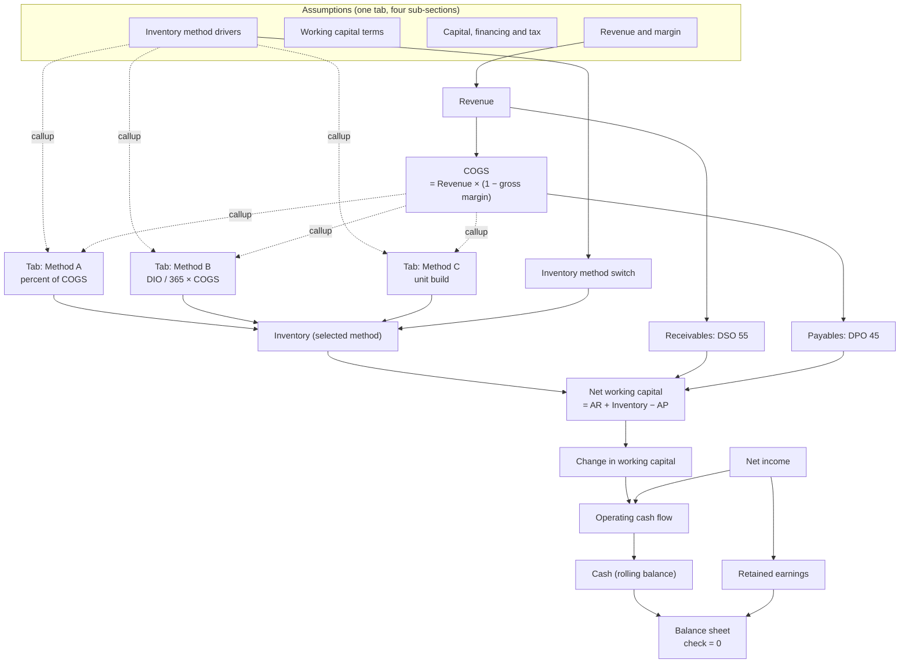

# 📦 Inventory Modelling: Three Methods

> Percent of COGS, days inventory outstanding, unit build. The same business modelled three ways at once, with one switch deciding which one drives the balance sheet.

  

A teaching model and a fork-and-adapt base for **any inventory-carrying business**. The worked example is a products company going from €40.0M to €64.6M of revenue over five years. Its real subject is not the business, it is the method you use to forecast the inventory line.

---

## The three methods, side by side

Each method gets **its own tab**, so you can read one recipe without the other two in the way.

| Tab | Formula | The assumption you own |
|---|---|---|
| **Method A: percent of COGS** | `ABS(COGS) × ratio` | One ratio. Simple, and structurally blind to any efficiency gain. |
| **Method B: days inventory outstanding** | `ABS(COGS) × DIO / 365` | A number of days. Benchmarkable, negotiable, improvable. The standard 3-statement choice. |
| **Method C: unit build** | `units / 12 × months of cover × unit cost` | Cover and unit cost. The only one that survives a change in mix or supplier lead time. |

All three compute on every period, permanently. `Inventory method switch` (1 / 2 / 3) decides which result flows into working capital, and `Inventory (selected method)` is the single line every downstream statement reads.

**Every driver still lives in one place.** The `Assumptions` tab is the only source of truth, grouped in four sub-sections: revenue and margin, working capital terms, capital and financing and tax, and inventory method drivers. Each method tab *mirrors* the drivers it needs through callups, so it reads as a self-contained recipe without becoming a second place to edit a number.

## Year 1 they agree. Year 5 they don't.

Each method is anchored on the same starting position, which is exactly what you do when you set a model up.

| Method | Inventory 2025 | Inventory 2029 | Implied days 2029 |
|---|--:|--:|--:|
| A. Percent of COGS (18.6%) | 4,315,200 | 6,849,537 | 68 |
| B. Inventory days (68 → 62) | 4,322,192 | 6,255,285 | 62 |
| C. Unit build (2.24 → 1.95 months) | 4,330,667 | 5,984,138 | 59 |

**€865,398 of spread on the same business.** Method A's implied days never move: a fixed ratio has no way to express an efficiency gain, so it silently assumes the business never improves.

That gap is not left for you to work out: the `Inventory selection` tab carries `Spread A vs B` and `Spread A vs C` as lines of the model, so the cost of each simplification is on screen next to the choice.

## The P&L is identical on all three

Inventory is a balance sheet stock. It never touches the income statement, so the method is invisible to anyone reviewing the P&L.

| Line | 2025 | 2026 | 2027 | 2028 | 2029 |
|---|--:|--:|--:|--:|--:|
| Revenue | 40,000,000 | 46,000,000 | 52,440,000 | 58,732,800 | 64,606,080 |
| COGS | (23,200,000) | (26,680,000) | (30,153,000) | (33,477,696) | (36,825,466) |
| **Gross profit** | **16,800,000** | **19,320,000** | **22,287,000** | **25,255,104** | **27,780,614** |
| Opex | (12,000,000) | (13,800,000) | (15,732,000) | (17,619,840) | (19,381,824) |
| **EBITDA** | **4,800,000** | **5,520,000** | **6,555,000** | **7,635,264** | **8,398,790** |
| D&A | (1,200,000) | (1,300,000) | (1,400,000) | (1,500,000) | (1,600,000) |
| Interest | (300,000) | (300,000) | (300,000) | (300,000) | (300,000) |
| Income tax | (825,000) | (980,000) | (1,213,750) | (1,458,816) | (1,624,698) |
| **Net income** | **2,475,000** | **2,940,000** | **3,641,250** | **4,376,448** | **4,874,093** |

The entire difference lands in cash instead:

| Method | Closing cash 2029 | Cash conversion cycle 2029 |
|---|--:|--:|
| A. Percent of COGS | 14,312,217 | 78 days |
| B. Inventory days | 14,906,469 | 72 days |
| C. Unit build | 15,177,616 | 69 days |

Nothing else in the model changes between the three runs, so the cash gap **is** the inventory gap. Every euro parked in the warehouse is a euro that does not reach the bank account.

---

## Structure

Dotted arrows are callups: a method tab mirrors the driver and the COGS base it reads, rather than owning them. Only one line in the whole model references a method, the switch. Everything downstream reads `Inventory (selected method)`, which is why flipping between methods recomputes the statements without breaking a single link.

## Balance sheet

Shown on method B, the default.

| | 2025 | 2026 | 2027 | 2028 | 2029 |
|---|--:|--:|--:|--:|--:|
| Cash | 3,835,685 | 5,452,288 | 7,869,502 | 11,089,875 | 14,906,469 |
| Receivables | 6,027,397 | 6,931,507 | 7,901,918 | 8,850,148 | 9,735,163 |
| Inventory | 4,322,192 | 4,970,521 | 5,452,323 | 5,870,062 | 6,255,285 |
| PP&E | 9,200,000 | 9,400,000 | 9,600,000 | 9,800,000 | 10,000,000 |
| **Total assets** | **23,385,274** | **26,754,315** | **30,823,743** | **35,610,085** | **40,896,917** |
| **Total liabilities and equity** | **23,385,274** | **26,754,315** | **30,823,743** | **35,610,085** | **40,896,917** |
| **Balance check** | **0** | **0** | **0** | **0** | **0** |

The check holds on all five periods **and on all three methods**, verified by re-running the model with the switch on 1 and on 3.

## Conventions

- **Currency**: EUR, whole euros, yearly grain only.
- **Sign**: costs and outflows negative, so every subtotal is a plain sum.
- **Opening working capital** is an explicit assumption (€6,550,000), so year 1 does not absorb the entire working capital build as a phantom cash outflow. This is the mistake that makes a first forecast year look far worse than it is.
- P&L → balance sheet: net income is a callup child of retained earnings, never entered by hand. Cash flow → balance sheet: net change in cash is the only flow into the cash balance.

## Known simplifications

One inventory pool, no SKU and no seasonality. No returns, discounts or obsolescence provision. Depreciation is an input schedule, not a fixed-asset register. Debt and share capital are static: there is no financing logic on purpose. Tax is a flat rate on positive profit before tax, with no loss carry-forward. If channel economics are your question rather than method choice, pair this with the [E-commerce & Retail](../ecommerce-retail/) model.

## How to use it

1. **[Open it in Layerz](https://layerz.cc/models/4dd73ff7-3ce6-4e87-b823-6699f4985255)** (free account) and **fork** it.
2. Replace base revenue, growth and gross margin with yours.
3. **Anchor all three methods on your last closed year** so they start from the same inventory balance. This is the step that makes the comparison honest.
4. Flip `Inventory method switch` between 1, 2 and 3 and read the closing cash line each time.
5. If the three answers land within a rounding error, your inventory is immaterial and you can stop thinking about it. If they don't, you have found a number worth defending.

---

*Part of [Finance Models](../../README.md). Built with [Layerz](https://layerz.cc). We share the recipe, not the black box.*
