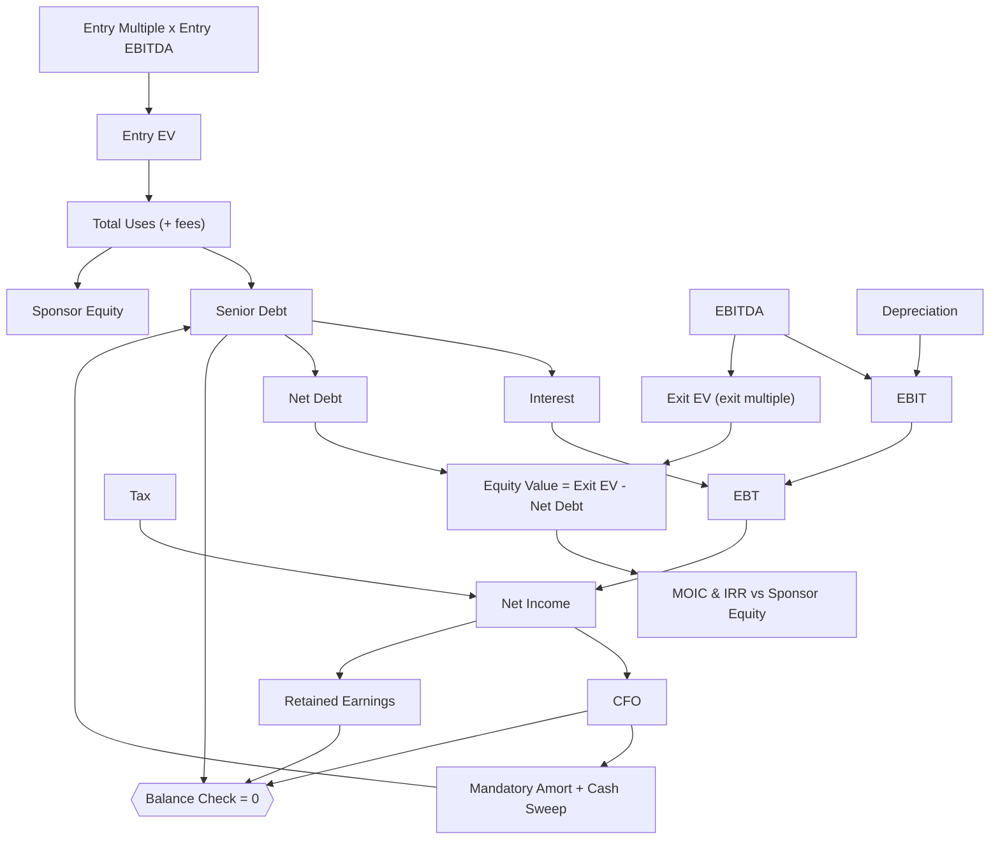

# 💰 LBO - Mid-Market Buyout

> A leveraged buyout of a €25m-EBITDA business: sources and uses, senior debt sized off EBITDA with a cash sweep, sponsor IRR and MOIC, and three statements that tie out every year. Returns come from growth and deleveraging, not multiple expansion.

  

-555)

Change a driver (entry multiple, leverage, growth, exit multiple, sweep) and the whole deal reprices: debt schedule, the three statements, IRR and MOIC. The senior debt amortises with a capped cash sweep, so it never goes negative, and the balance sheet ties out in all six years (`Balance Check` = 0, monitored).

---

## Dashboard: at a glance

| | |
|---|---|
| **Entry EBITDA** | €25.0 m |
| **Entry EV** | €250 m (10.0x) |
| **Entry leverage** | 5.5x (senior debt €137.5 m) |
| **Sponsor equity** | €120.0 m |
| **Hold** | 5 years (entry 2025, exit 2030) |
| **Exit EBITDA** | €36.7 m (8%/yr growth) |
| **Sponsor MOIC** | 2.53x |
| **Sponsor IRR** | 20% |

---

## Sources & uses at entry (k€)

| Uses | | Sources | |
|---|--:|---|--:|
| Enterprise value (10.0x) | 250,000 | Senior debt (5.5x EBITDA) | 137,500 |
| Transaction fees (3%) | 7,500 | Sponsor equity | 120,000 |
| **Total uses** | **257,500** | **Total sources** | **257,500** |

## The deal through the hold (k€)

| | 2025 entry | 2026 | 2027 | 2028 | 2029 | 2030 exit |
|---|--:|--:|--:|--:|--:|--:|
| EBITDA | 25,000 | 27,000 | 29,160 | 31,493 | 34,012 | 36,733 |
| Senior debt | 137,500 | 126,954 | 114,554 | 100,051 | 83,175 | 63,633 |
| Net leverage | 5.5x | 4.7x | 3.9x | 3.2x | 2.4x | 1.7x |
| MOIC if exited | | 1.19x | 1.48x | 1.79x | 2.14x | 2.53x |

The cash sweep takes net leverage from 5.5x to 1.7x over the hold; every euro of debt repaid accrues to equity.

## Where the return comes from (k€)

| Value bridge, entry equity to exit equity | |
|---|--:|
| Sponsor equity invested | 120,000 |
| + EBITDA growth at a flat 10.0x multiple | +117,332 |
| + Debt paydown (deleveraging) | +73,867 |
| − Entry transaction fees | (7,500) |
| **= Equity value at exit** | **303,699** |

**2.53x MOIC, 20% IRR**, with no help from multiple expansion (exit multiple held equal to entry). Push the exit multiple, the growth rate or the leverage and watch the return move.

---

## Structure

The three statements are wired, not pasted: net income flows to retained earnings, the cash sweep pays down the debt, and the cash flow rolls into the closing balance. `Balance Check` = Assets − Liabilities − Equity is monitored at 0 in every period.

## Conventions

- **Currency**: EUR thousands (k€). **Sign**: revenues positive, costs and outflows negative.
- **Timeline**: yearly, 2025-2030. 2025 is entry (debt and equity drawn, business acquired); 2026-2030 are the five hold years; exit is end 2030.
- **Kept clean**: no working capital modelled, goodwill not amortised. Fork it and add those where your deal needs them.

Full conventions live in the model's `FINANCE.md`.

---

## How to use it

1. **[Open it in Layerz](https://layerz.cc/models/57af5678-5e56-44bc-9d46-379b8eb961b6)** (free account) and **fork** it: you get a model you own.
2. Change the drivers in `Assumptions` (entry EBITDA, multiples, leverage, growth, rate, sweep). The debt schedule, the statements, the IRR and the MOIC all recompute, and the balance check stays at 0.
3. Export to Excel any time. The export is clean and auditable.

---

*Part of [Finance Models](../../README.md). Built with [Layerz](https://layerz.cc). We share the recipe, not the black box.*
