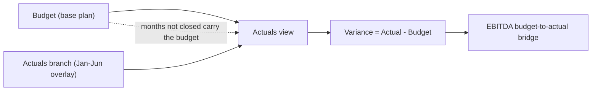

# 📊 Monthly Close - Actuals vs Budget

> A monthly management P&L where the budget and the actuals are the same model, not two spreadsheets. Overlay the closed months on an Actuals branch and the variance, plus the EBITDA budget-to-actual bridge, fall out on their own.

  

-555)

The budget lives on the base plan. A Layerz **Actuals** branch overrides the closed months (here January to June); the months it does not cover keep the budget, so the branch reads as actuals-to-date plus reforecast. Variance is simply the actuals view minus the budget: no parallel file, no copy-paste, no drift.

---

## The close through June (YTD, k€)

| Line | Budget | Actual | Variance |
|---|--:|--:|--:|
| Revenue | 5,100 | 5,250 | **+150** |
| COGS | (1,122) | (1,180) | (58) |
| **Gross profit** | **3,978** | **4,070** | **+92** |
| Sales and marketing | (1,530) | (1,620) | (90) |
| Research and development | (1,020) | (1,020) | 0 |
| General and admin | (612) | (580) | +32 |
| **Total opex** | **(3,162)** | **(3,220)** | **(58)** |
| **EBITDA** | **816** | **850** | **+34** |

Revenue beat the plan, but part of it was reinvested (higher COGS and sales spend), while G&A came in under. Net EBITDA is 34 ahead of budget.

## EBITDA bridge: budget to actual (k€)

| Step | k€ |
|---|--:|
| Budget EBITDA (YTD) | 816 |
| + Revenue | +150 |
| − COGS | (58) |
| − Sales and marketing | (90) |
| − Research and development | 0 |
| + General and admin | +32 |
| **= Actual EBITDA (YTD)** | **850** |

---

## How budget, actuals and variance work

- **Base = Budget**: the full-year monthly budget on every line.
- **Actuals branch**: overrides the input lines for the closed months only (`actuals_through` = June).
- **Carry-forward**: uncovered months keep the budget, so the branch is actuals-to-date plus reforecast for the rest of the year.
- **Variance** is the diff between the two, and the in-app dashboard shows the budget-vs-actual mini-table, the EBITDA delta and the two curves side by side.

This is the point: the variance is a property of one model, not a reconciliation between two files.

## Conventions

- **Currency**: EUR thousands (k€). **Sign**: revenues positive, costs negative.
- **Timeline**: monthly, FY2026. Actuals through June; July to December carry the budget.
- Deliberately compact (a five-line P&L). Fork it and swap in your own chart of accounts and cost lines.

Full conventions live in the model's `FINANCE.md`.

---

## How to use it

1. **[Open it in Layerz](https://layerz.cc/models/ccea856a-6ee5-4f79-b891-e1c321daac4d)** (free account) and **fork** it: you get a model you own.
2. Each month, add that month's actuals to the Actuals branch (type them or import a file). The variance, the bridge and the reforecast update on their own.
3. Export to Excel any time. The export is clean and auditable.

---

*Part of [Finance Models](../../README.md). Built with [Layerz](https://layerz.cc). We share the recipe, not the black box.*
