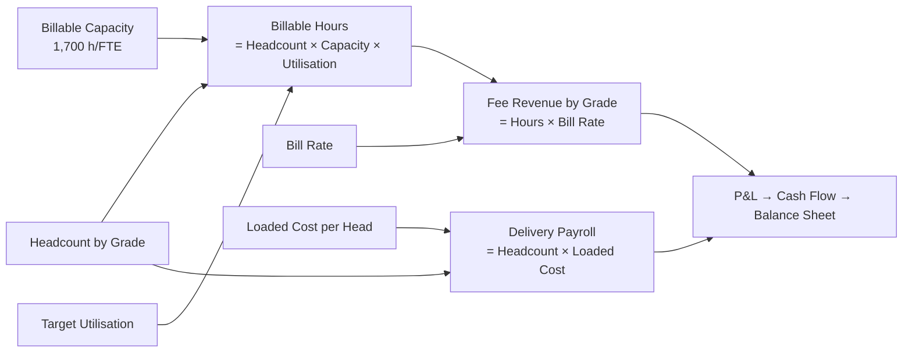

# 💼 Professional Services Firm - Consulting

> Revenue is not a growth rate. It is headcount × capacity × utilisation × bill rate, resolved grade by grade. Change one utilisation cell and the whole firm moves.

  

A fork-and-adapt base for **any people-based business**: consulting, agency, engineering studio, accounting or legal practice. The worked example is a firm going from 29 to 46 fee earners and €5.3M to €9.2M of fees.

---

## The pyramid drives everything

| Grade | Headcount 2026 → 2028 | Utilisation | Bill rate 2026 | Loaded cost 2026 |
|---|--:|--:|--:|--:|
| Partner | 3 → 4 | 35% | €320/h | €180,000 |
| Manager | 6 → 10 | 65% | €210/h | €110,000 |
| Consultant | 12 → 20 | 78% | €145/h | €72,000 |
| Analyst | 8 → 12 | 82% | €95/h | €48,000 |

Capacity is 1,700 billable hours per FTE per year, net of holiday, training and internal time. Partners sit at 35% because their time goes to origination, not delivery.

**To add a grade, add one element to the `Grades` list and fill its four cells.** Hours, revenue, payroll and every metric extend on their own.

## Fee build 2026

| Grade | Billable hours | Fee revenue (€) |
|---|--:|--:|
| Partner | 1,785 | 571,200 |
| Manager | 6,630 | 1,392,300 |
| Consultant | 15,912 | 2,307,240 |
| Analyst | 11,152 | 1,059,440 |
| **Total** | **35,479** | **5,330,180** |

## P&L (€)

| Line | 2026 | 2027 | 2028 |
|---|--:|--:|--:|
| Fee revenue | 5,330,180 | 7,105,201 | 9,218,454 |
| Delivery cost (payroll + subcontracting) | (2,874,414) | (3,741,416) | (4,891,476) |
| **Gross profit** | **2,455,766** | **3,363,785** | **4,326,978** |
| Overheads (non-billable) | (1,700,000) | (2,150,000) | (2,700,000) |
| **EBITDA** | **755,766** | **1,213,785** | **1,626,978** |
| D&A | (24,000) | (36,000) | (50,000) |
| **EBIT** | **731,766** | **1,177,785** | **1,576,978** |
| Interest | (10,000) | (10,000) | (7,500) |
| Income tax | (180,441) | (291,946) | (392,370) |
| **Net income** | **541,324** | **875,839** | **1,177,108** |

## Firm metrics

| Metric | 2026 | 2027 | 2028 |
|---|--:|--:|--:|
| Blended utilisation | 72.0% | 72.8% | 72.5% |
| Leverage (fee earners per partner) | 8.7x | 11.3x | 10.5x |
| Realised rate | €150/h | €155/h | €163/h |
| Fee revenue per FTE | €183,799 | €192,032 | €200,401 |
| Gross margin | 46.1% | 47.3% | 46.9% |
| EBITDA margin | 14.2% | 17.1% | 17.6% |

The realised rate sits below every rate on the card, because the mix is mostly consultants and analysts. That gap between rate card and realised rate is usually where a services firm's margin actually lives.

---

## How the engine resolves

Three levers move the firm and each is one row: **utilisation** (sell more of the capacity you already pay for), **rate** (price), **leverage** (fee earners per partner). A revenue-growth assumption hides all three.

## Working capital is the real constraint

A services firm has no inventory. It has **work in progress**: delivered, not yet invoiced. The model carries WIP at 25 days of fee revenue, next to 75 days DSO.

| Line | 2026 | 2027 | 2028 |
|---|--:|--:|--:|
| Receivables | 1,095,242 | 1,459,973 | 1,894,203 |
| Work in progress (unbilled) | 365,081 | 486,658 | 631,401 |
| **Operating cash flow** | **(737,497)** | **473,039** | **711,152** |
| Cash | 242,503 | 605,542 | 1,196,693 |

**Year 1 is profitable and cash-negative.** €1.46M goes into receivables and WIP against €0.76M of EBITDA. That is the most common way a growing consultancy gets into trouble, and it is why the model opens with €900k of capital.

## Balance sheet

| | 2026 | 2027 | 2028 |
|---|--:|--:|--:|
| Total assets | 1,798,826 | 2,672,172 | 3,862,297 |
| Total liabilities | 357,502 | 355,009 | 368,026 |
| Total equity | 1,441,324 | 2,317,163 | 3,494,271 |
| **Balance check** | **0** | **0** | **0** |

## Conventions

- **Currency**: EUR. **Sign**: revenues positive, costs, D&A, interest and tax negative, so subtotals are simple sums. The `by Grade` payroll line is stored positive and negated by the P&L.
- **Overheads** is a single line covering support staff, premises, tooling, marketing and business development.

## Known simplifications

One blended bill rate per grade: no client, country or engagement-type mix, and no fixed-price or success-fee work. Bench cost is not a named line, so under-utilisation shows up as margin. Payables run on delivery cost at 20 days, a proxy for accrued payroll and supplier terms.

## How to use it

1. **[Open it in Layerz](https://app.layerz.cc/models/d0e3688b-eceb-4341-ada1-e8a45957b3d8)** (free account) and **fork** it.
2. Replace the `Grades` list with your own titles, then fill headcount, utilisation, rates and loaded cost.
3. Re-base capacity, days WIP and DSO on your own invoicing reality. They drive the cash line more than the P&L does.
4. Export to Excel any time. The export is clean and auditable.

---

*Part of [Finance Models](../../README.md). Built with [Layerz](https://layerz.cc). We share the recipe, not the black box.*
