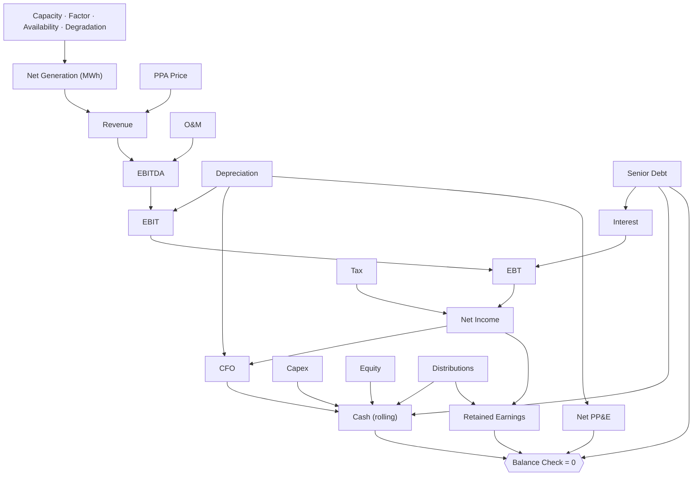

# 🏗️ Infrastructure Project Finance

> A reusable project-finance template for a capex-heavy asset on a long-term contract: sized senior debt, DSCR and equity IRR, and three statements that tie out every year. Worked example here: a 500 MW offshore wind farm on a 20-year PPA.

  

-555)

The structure is the point, not the sector. Change a driver (capacity, price, gearing, tenor) and every statement recomputes; the balance sheet ties out in all 21 years (`Balance Check` = 0, monitored), and the senior debt amortises straight to zero at maturity with no negative-balance artifact.

## Reuse it for any infrastructure asset

Project finance is the same skeleton whatever the asset: a large upfront capex, funded by sized senior debt plus sponsor equity, repaid from long-term contracted cash flows, tested on DSCR and equity IRR. To retheme this model, keep the structure and swap the asset drivers:

- **Solar or battery storage**: capacity, capacity factor, PPA price, degradation.
- **Digital infrastructure (towers, data centres)**: sites or racks, lease rate, occupancy, opex per unit.
- **Transport (toll road, rail)**: traffic, tariff, ramp-up curve.
- **Any asset**: capex per unit, gearing, debt rate and tenor, tax, asset life.

The debt sizing, the three statements and the coverage ratios do not change. That is what makes it worth keeping as a template.

---

## Dashboard: at a glance

| | |
|---|---|
| **Installed capacity** | 500 MW |
| **Total capex** | €1.50 bn (3,000 k€/MW) |
| **Senior debt at COD** | €975 m (65% gearing, 5.0%, 18-yr) |
| **Sponsor equity** | €525 m |
| **Year-1 net generation** | 2,080,500 MWh |
| **Year-1 EBITDA** | €142.2 m (76% margin) |
| **Minimum DSCR** | 1.34x |
| **Project equity IRR** | 6% |

---

## P&L: first operating year (2027)

| Line | k€ |
|---|--:|
| Revenue | 187,245 |
| O&M | (45,000) |
| **EBITDA** | **142,245** |
| Depreciation | (75,000) |
| **EBIT** | **67,245** |
| Interest expense | (48,750) |
| **EBT** | **18,495** |
| Tax (25%) | (4,624) |
| **Net income** | **13,871** |

### How it evolves over the debt term

| Year | Revenue | EBITDA | Net income | DSCR |
|---|--:|--:|--:|--:|
| 2027 | 187,245 | 142,245 | 13,871 | 1.34x |
| 2031 | 183,528 | 138,528 | 19,209 | 1.43x |
| 2036 | 178,986 | 133,986 | 25,958 | 1.60x |
| 2041 | 174,555 | 129,555 | 32,792 | 1.82x |
| 2044 | 171,950 | 126,950 | 36,931 | 2.02x |

As the debt amortises, interest falls, net income climbs and coverage widens from 1.34x to 2.02x. Revenue drifts down gently on 0.5%/yr turbine degradation.

## Generation & funding

| Generation | | | Funding | |
|---|--:|---|---|--:|
| Capacity | 500 MW | | Total capex | 975,000 k€ + 525,000 k€ |
| Net capacity factor | ~47.5% | | Senior debt (65%) | 975,000 k€ |
| Year-1 net generation | 2,080,500 MWh | | Sponsor equity (35%) | 525,000 k€ |
| Annual degradation | 0.5% | | Debt rate / tenor | 5.0% / 18 yrs |
| Year-20 net generation | 1,891,500 MWh | | Distribution policy | full cash sweep |

---

## Structure

The three statements are wired, not pasted: net income flows to retained earnings, the cash flow rolls into the closing cash balance, and depreciation feeds both the P&L and accumulated depreciation. `Balance Check` = Assets − Liabilities − Equity is monitored at 0 in every period.

## Conventions

- **Currency**: EUR thousands (k€). **Sign**: revenues positive, costs and outflows negative.
- **Timeline**: yearly, 2026-2046. 2026 is construction (capex, debt and equity drawn, no generation); 2027-2046 are 20 operating years; debt tenor is 18 years.
- **Distribution policy**: full cash sweep to equity, so cash stays at zero and retained earnings wind down as capital is returned over the asset life. That is expected SPV behaviour, not a balancing error.

Full conventions live in the model's `FINANCE.md`.

---

## How to use it

1. **[Open it in Layerz](https://app.layerz.cc/models/5e54258d-e4b6-48a0-91b0-32d4271fe224)** (free account) and **fork** it: you get a model you own.
2. Change the drivers in `Assumptions` (capacity, PPA price, capex per MW, gearing, rate, tenor). Every statement, the DSCR and the equity IRR recompute, and the balance check stays at 0.
3. Export to Excel any time. The export is clean and auditable.

---

*Part of [Finance Models](../../README.md). Built with [Layerz](https://layerz.cc). We share the recipe, not the black box.*
