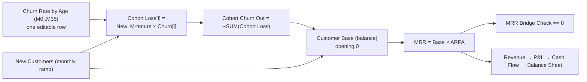

# 👥 SaaS Cohort Revenue Projection

> Recurring revenue projected by acquisition cohort, with churn structured by tenure rather than a flat rate. The customer count is a stock, not a formula, and the MRR bridge ties out to the cent every month.

  

Most SaaS plans churn the whole customer base at one monthly rate. That flatters the early months and understates the tail. Here each acquisition cohort carries **its own churn curve by month of tenure** (M0 to M35): first-month churn is heavy, then it decays towards a floor. The base is a real stock that rises with acquisitions and falls with the sum of every cohort's loss.

Two monitors hold it honest: the **MRR bridge check** (opening + new + expansion + churned = closing) and the **balance check** (assets = liabilities and equity), both at 0 every month.

---

## At a glance (December exit)

| Metric | Dec 2026 | Dec 2027 | Dec 2028 |
|---|--:|--:|--:|
| Customer base | 334 | 1,310 | 4,368 |
| MRR (€) | 157,237 | 646,373 | 2,260,497 |
| **ARR (€)** | **1,886,847** | **7,756,481** | **27,125,969** |
| New customers that month | 52 | 162 | 510 |
| ARPA (€/month) | 470 | 493 | 518 |
| NRR (monthly) | 97% | 98% | 98% |
| Cash (€) | 587,545 | 3,565,039 | 4,410,303 |

## P&L (€, full year)

| Line | 2026 | 2027 | 2028 |
|---|--:|--:|--:|
| Revenue | 873,572 | 4,503,693 | 16,376,788 |
| COGS | (131,036) | (675,554) | (2,456,518) |
| **Gross profit** | **742,536** | **3,828,139** | **13,920,269** |
| Sales & marketing | (483,600) | (1,461,600) | (4,588,800) |
| R&D | (157,243) | (810,665) | (2,947,822) |
| G&A | (104,829) | (540,443) | (1,965,215) |
| **EBITDA** | **(3,136)** | **1,015,431** | **4,418,433** |
| D&A | (26,500) | (38,500) | (50,500) |
| **EBIT** | **(29,636)** | **976,931** | **4,367,933** |
| Income tax | (13,464) | (244,233) | (1,091,983) |
| **Net income** | **(43,099)** | **732,698** | **3,275,950** |

Revenue is the sum of the twelve monthly MRRs, which is why full-year 2026 revenue (874k) sits well below the December exit ARR (1.89M). Tax is computed monthly on positive EBIT, so a year that closes at a small loss can still carry tax from its profitable months.

## Balance sheet (December exit, €)

| Line | Dec 2026 | Dec 2027 | Dec 2028 |
|---|--:|--:|--:|
| Cash | 587,545 | 3,565,039 | 4,410,303 |
| Receivables | 235,856 | 969,560 | 3,390,746 |
| Fixed assets (net) | 133,500 | 155,000 | 164,500 |
| **Total assets** | **956,901** | **4,689,599** | **7,965,549** |
| Paid-in capital | 1,000,000 | 4,000,000 | 4,000,000 |
| Retained earnings | (43,099) | 689,599 | 3,965,549 |
| **Total equity** | **956,901** | **4,689,599** | **7,965,549** |
| **Balance check** | **0** | **0** | **0** |

A €3M Series A lands in January 2027. Every non-cash balance sheet line has its cash flow mirror, so the identity holds without a plug.

---

## The cohort engine

- **`Churn Rate by Age`** is a list-assumption on a `Tenure (months)` list: the share of a cohort lost at each month of its life. One row, thirty-six cells, and it is the only place retention is expressed.
- **`tenure_index = LIST_INDEX`** turns the position in that list into a dynamic lag, so `Cohort Loss[i]` reads the acquisition cohort that is exactly `i` months old.
- **`Customer Base`** is a **balance** with two flows, acquisitions and churn. It is a stock, so it cannot silently drift away from the flows that feed it.
- Churn is explicit through M35, the full horizon, so no cohort is dumped into a "mature pool" with an averaged rate.

## Unit economics

| Metric | Dec 2026 | Dec 2027 | Dec 2028 |
|---|--:|--:|--:|
| Gross margin | 85% | 85% | 85% |
| LTV (€) | 49,959 | 52,413 | 54,984 |
| LTV to CAC | 41.6x | 43.7x | 45.8x |
| CAC payback (months) | 3.0 | 2.9 | 2.7 |

Read these with care. LTV uses the separate `Steady Churn (LTV)` driver, not the cohort curve, and the demo value for it is deliberately low, which is what produces a 40x plus LTV to CAC. Re-base that one driver on your own steady-state churn before quoting any of these four numbers.

## Conventions

- **Currency**: EUR, absolute units. **Sign**: revenues positive, costs, D&A and taxes negative, so subtotals are simple sums. Capex positive, negated in the cash flow.
- **Grain**: monthly, 36 months (2026-01 to 2028-12). The cohort engine only makes sense monthly.
- **Opening**: cash 900k plus gross PPE 100k = equity 1,000k. Customer base opens at 0.

## Known simplifications

`Churn Rate by Age` is the share of the **original cohort** lost at each month of tenure, not a churn of survivors. Beyond M35 the base is stable, since M35 is the horizon. Working capital is receivables only (DSO). Single ARPA per month, so expansion is expressed by ARPA rising rather than by seat or tier movement.

## How to use it

1. **[Open it in Layerz](https://app.layerz.cc/models/0cf40614-eb52-48b9-8d72-cbecc84860b2)** (free account) and **fork** it: you get a model you own.
2. Edit three levers: the **churn curve** by tenure, the **new customers** ramp, and **ARPA**. The customer stock, the revenue and all three statements recompute.
3. Confirm `MRR Bridge Check == 0` and `Balance Check == 0`. If a change breaks either, the monitor turns red before the number reaches a slide.
4. Export to Excel any time. The export is clean and auditable.

---

*Part of [Finance Models](../../README.md). Built with [Layerz](https://layerz.cc). We share the recipe, not the black box.*
