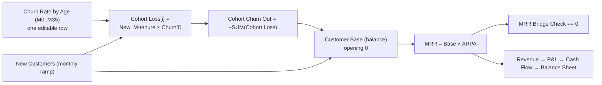

# 👥 SaaS Cohort Revenue Projection

> Recurring revenue projected by acquisition cohort, with churn structured by tenure rather than a flat rate. The customer count is a stock, not a formula, and the MRR bridge ties out to the cent every month.

  

Most SaaS plans churn the whole customer base at one monthly rate. That flatters the early months and understates the tail. Here each acquisition cohort carries **its own churn curve by month of tenure** (M0 to M35): first-month churn is heavy, then it decays towards a floor. The base is a real stock that rises with acquisitions and falls with the sum of every cohort's loss.

Two monitors hold it honest: the **MRR bridge check** (opening + new + expansion + churned = closing) and the **balance check** (assets = liabilities and equity), both at 0 every month.

---

## At a glance (December exit)

| Metric | Dec 2026 | Dec 2027 | Dec 2028 |
|---|--:|--:|--:|
| Customer base | 334 | 1,310 | 4,368 |
| MRR (€) | 157,237 | 646,373 | 2,260,497 |
| **ARR (€)** | **1,886,847** | **7,756,481** | **27,125,969** |
| New customers that month | 52 | 162 | 510 |
| ARPA (€/month) | 470 | 493 | 518 |
| NRR (monthly) | 97% | 98% | 98% |
| Cash (€) | 278,609 | 2,506,803 | 1,057,667 |

## P&L (€, full year)

| Line | 2026 | 2027 | 2028 |
|---|--:|--:|--:|
| Revenue | 873,572 | 4,503,693 | 16,376,788 |
| COGS | (131,036) | (675,554) | (2,456,518) |
| **Gross profit** | **742,536** | **3,828,139** | **13,920,269** |
| Sales & marketing | (806,000) | (2,436,000) | (7,648,000) |
| R&D | (157,243) | (810,665) | (2,947,822) |
| G&A | (104,829) | (540,443) | (1,965,215) |
| **EBITDA** | **(325,536)** | **41,031** | **1,359,233** |
| D&A | (26,500) | (38,500) | (50,500) |
| **EBIT** | **(352,036)** | **2,531** | **1,308,733** |
| Income tax | 0 | (19,133) | (327,183) |
| **Net income** | **(352,036)** | **(16,602)** | **981,550** |

Revenue is the sum of the twelve monthly MRRs, which is why full-year 2026 revenue (874k) sits well below the December exit ARR (1.89M). Tax is computed monthly on positive EBIT, so 2027 closes at a small net loss and still carries €19k of tax from its profitable months.

## Balance sheet (December exit, €)

| Line | Dec 2026 | Dec 2027 | Dec 2028 |
|---|--:|--:|--:|
| Cash | 278,609 | 2,506,803 | 1,057,667 |
| Receivables | 235,856 | 969,560 | 3,390,746 |
| Fixed assets (net) | 133,500 | 155,000 | 164,500 |
| **Total assets** | **647,964** | **3,631,363** | **4,612,913** |
| Paid-in capital | 1,000,000 | 4,000,000 | 4,000,000 |
| Retained earnings | (352,036) | (368,637) | 612,913 |
| **Total equity** | **647,964** | **3,631,363** | **4,612,913** |
| **Balance check** | **0** | **0** | **0** |

A €3M Series A lands in January 2027. Every non-cash balance sheet line has its cash flow mirror, so the identity holds without a plug.

---

## The cohort engine

- **`Churn Rate by Age`** is a list-assumption on a `Tenure (months)` list: the share of a cohort lost at each month of its life (10% at M1, decaying to a 0.2% floor from M12). One row, thirty-six cells, and it is the only place retention is expressed.
- **`tenure_index = LIST_INDEX`** turns the position in that list into a dynamic lag, so `Cohort Loss[i]` reads the acquisition cohort that is exactly `i` months old.
- **`Customer Base`** is a **balance** with two flows, acquisitions and churn. It is a stock, so it cannot silently drift away from the flows that feed it.
- Churn is explicit through M35, the full horizon, so no cohort is dumped into a "mature pool" with an averaged rate.

## Unit economics

| Metric | Dec 2026 | Dec 2027 | Dec 2028 |
|---|--:|--:|--:|
| Gross margin | 85% | 85% | 85% |
| LTV (€) | 10,802 | 11,333 | 11,889 |
| LTV to CAC | 5.4x | 5.7x | 5.9x |
| CAC payback (months) | 5.0 | 4.8 | 4.6 |

**The LTV convention is the interesting part.** LTV divides by `Steady Churn (LTV)`, set here to **3.7% per month, which is `1 / 27.1 months`**: the expected lifetime the churn curve actually implies over the 36 months the model projects (the sum of survival from M0 to M35). It claims no credit for a tail beyond the horizon.

That choice is doing a lot of work. Read the same curve as a perpetual 0.2% floor instead and the implied lifetime becomes 125 months, LTV jumps past €49k and LTV to CAC reads above 40x. Nothing else in the model changes. It is the cleanest illustration of why an LTV figure is only as good as the convention printed next to it.

## Working capital is the real constraint

Operating cash flow stays **negative every single month**, even after EBITDA turns positive in mid-2027. At 45 days DSO on a base growing around 8% per month, receivables absorb more than the profit: they reach €3.4M by the end of 2028 against €1.4M of EBITDA that year.

Cash bottoms at €279k just before the Series A, recovers to €3.2M, then falls back to €1.1M by December 2028 and is still declining. **This plan needs further funding beyond 2028.** That is a property of the growth rate, not an error in the model, and it is exactly the kind of thing a revenue-only projection hides.

## Conventions

- **Currency**: EUR, absolute units. **Sign**: revenues positive, costs, D&A and taxes negative, so subtotals are simple sums. Capex positive, negated in the cash flow.
- **Grain**: monthly, 36 months (2026-01 to 2028-12). The cohort engine only makes sense monthly.
- **Opening**: cash 900k plus gross PPE 100k = equity 1,000k. Customer base opens at 0.

## Known simplifications

`Churn Rate by Age` is the share of the **original cohort** lost at each month of tenure, not a churn of survivors. Beyond M35 the base is stable, since M35 is the horizon. Working capital is receivables only (DSO). Single ARPA per month, so expansion is expressed by ARPA rising rather than by seat or tier movement.

## How to use it

1. **[Open it in Layerz](https://layerz.cc/models/0cf40614-eb52-48b9-8d72-cbecc84860b2)** (free account) and **fork** it: you get a model you own.
2. Edit three levers: the **churn curve** by tenure, the **new customers** ramp, and **ARPA**. The customer stock, the revenue and all three statements recompute.
3. Re-base **`SnM CAC`** and **`Steady Churn (LTV)`** on your own data before quoting any unit economics.
4. Confirm `MRR Bridge Check == 0` and `Balance Check == 0`. If a change breaks either, the monitor turns red before the number reaches a slide.
5. Export to Excel any time. The export is clean and auditable.

---

*Part of [Finance Models](../../README.md). Built with [Layerz](https://layerz.cc). We share the recipe, not the black box.*
