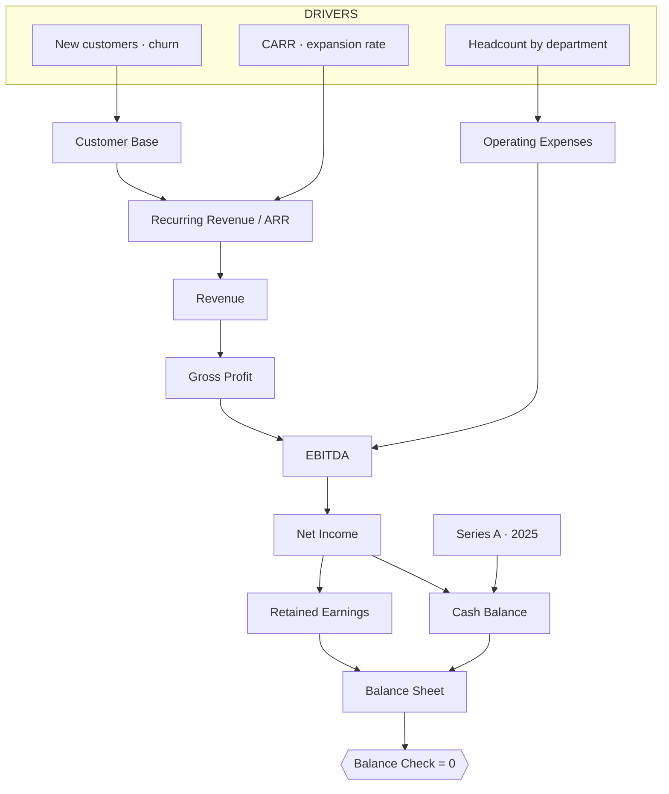

# 📈 SaaS Reporting & Forecast

> A B2B mid-market SaaS operating model, 2024–2028. Customer base → ARR → full three statements, with unit economics, a CFO dashboard, and a Budget-vs-Actuals close. Growth funded by a $3M Series A in 2025.

  

&nbsp;

---

## What it's for

A B2B SaaS entering 2024 with **30 customers, $500k cash and $600k equity**, scaling to **$20.9M ARR by 2028**. From acquisition and churn drivers it rolls a customer base, prices it into ARR, and ties out a P&L, Cash Flow and Balance Sheet, plus SaaS unit economics (CAC, LTV, Rule of 40) and a variance close. Built for a part-time CFO or a finance educator who needs a real, defensible SaaS model.

---

## Dashboard — 2028 at a glance

| ARR | ARR growth | Rule of 40 | Gross margin |
|:--:|:--:|:--:|:--:|
| **$20.9M** | **75%** | **123%** | **85%** |

<!-- Replace with a real screenshot of the Layerz CFO dashboard (export) placed in .github/assets/ -->

*The Layerz CFO dashboard, exported. ARR ramp, margin path and the J-curve to profitability, live-recomputed from the drivers.*

> **Actuals & variance.** 2024 is a closed year baked into the base. An **Actuals 2025** branch overlays the real FY2025 outcome, and a **Budget vs Actuals** close dashboard surfaces the gap (variance mini-table + EBITDA bridge). This is the "reporting" half, not just a forecast.

---

## P&L (USD)

| | 2024 | 2025 | 2026 | 2027 | 2028 |
|---|--:|--:|--:|--:|--:|
| Revenue | 1,641,800 | 3,561,760 | 6,428,180 | 12,063,376 | 21,070,986 |
| Total COS | (274,670) | (571,264) | (1,007,977) | (1,859,006) | (3,211,648) |
| **Gross Profit** | **1,367,130** | **2,990,496** | **5,420,203** | **10,204,370** | **17,859,338** |
| Gross Margin % | 83% | 84% | 84% | 85% | 85% |
| Total Operating Expenses | (2,356,000) | (3,589,000) | (4,832,000) | (6,422,000) | (7,923,500) |
| **EBITDA** | **(988,870)** | **(598,504)** | **588,203** | **3,782,370** | **9,935,838** |
| EBITDA Margin % | (60%) | (17%) | 9% | 31% | 47% |
| Depreciation & Amortization | (33,333) | (43,222) | (48,815) | (56,877) | (64,584) |
| EBIT | (1,022,203) | (641,726) | 539,388 | 3,725,493 | 9,871,254 |
| Income Tax | 0 | 0 | (134,847) | (931,373) | (2,467,814) |
| **Net Income** | **(1,022,203)** | **(641,726)** | **404,541** | **2,794,120** | **7,403,441** |
| Net Margin % | (62%) | (18%) | 6% | 23% | 35% |

## SaaS metrics

| | 2024 | 2025 | 2026 | 2027 | 2028 |
|---|--:|--:|--:|--:|--:|
| ARR | 1,570,800 | 3,461,760 | 6,303,180 | 11,913,376 | 20,900,986 |
| ARR growth | — | 120% | 82% | 89% | 75% |
| Rule of 40 | — | 104% | 91% | 120% | 123% |
| Active customers | 73 | 135 | 228 | 384 | 620 |
| Blended CAC | 26,651 | 21,875 | 21,242 | 18,315 | 16,210 |
| LTV : CAC | 4.5x | 9.7x | 12.0x | 17.6x | 24.8x |
| Cash balance (EoP) | (339,008) | 2,588,478 | 4,202,312 | 8,852,699 | 20,927,766 |

*The classic SaaS J-curve: cash dips negative in 2024, the 2025 Series A refuels it, and the model turns EBITDA-positive from 2026.*

---

## How it's wired

Sections: Assumptions · Operating Drivers · RH (list-driven roster) · P&L · Unit Economics · Cash Flow · Balance Sheet, monitored so **Assets − Liabilities − Equity = 0** every year, on the base and on the Actuals branch.

---

## Conventions

- **Currency:** USD, displayed `$0,0`
- **Periodicity:** yearly, 2024–2028
- **Sign convention:** `expenses_negative` — revenues positive; COS, OpEx, D&A and taxes stored **negative**, so subtotals add them (Gross Profit = Revenue + Total COS, EBITDA = Gross Profit + Total OpEx).

---

## How to use it

1. **[Open in Layerz](https://app.layerz.cc/models/39550987-f253-4a36-b067-6daddcb1e3ff)** and fork it (free account).
2. Edit the drivers — new customers/year, churn, CARR, expansion, headcount by department.
3. Watch ARR, the P&L and the unit economics recompute, and confirm **Balance Check == 0**.

> Known simplifications: depreciation = 3-year rolling capex average; Run COS = 15% of recurring revenue; build revenue delivered same period; salaries flat per employee within active years.

---

*Shared by [@anthomakr](https://github.com/anthomakr) · built with [Layerz](https://layerz.cc) · we share the recipe, not the black box.*
