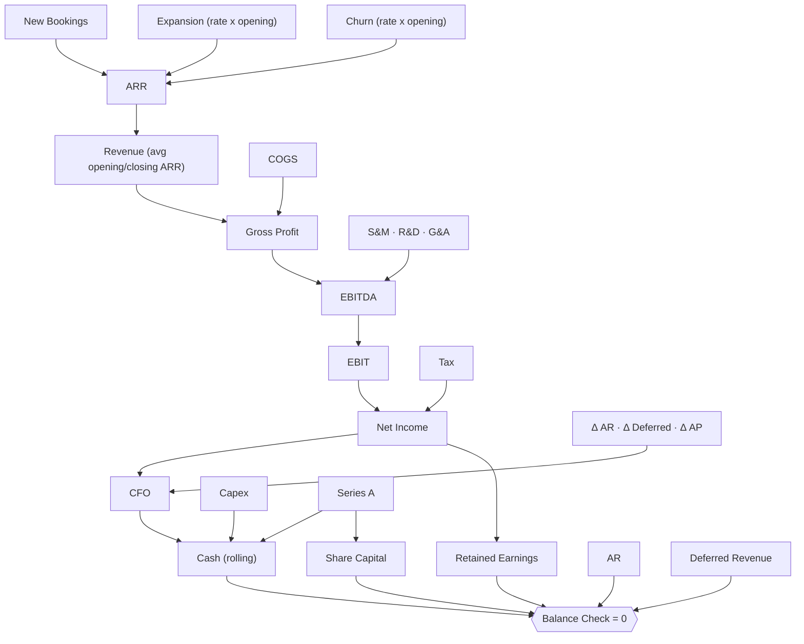

# 🚀 SaaS Scale-up - Series A Plan

> A B2B SaaS company raising an €8m Series A: the ARR build, the unit economics, the path to profitability and the cash runway, with three statements that tie out every year.

-555)

Change a driver (new bookings, churn, expansion, opex ratios, the raise) and every statement, the unit economics and the runway recompute. The raise is sized so cash never goes negative, and the balance sheet ties out in all five years (`Balance Check` = 0, monitored).

---

## Dashboard: at a glance

| | |
|---|---|
| **Series A raise** | €8.0 m (2026) |
| **Entry ARR to exit ARR** | €2.0 m → €23.1 m (6.3x in 5 years) |
| **ARR growth** | 85% (2026) tapering to 43% (2030) |
| **Gross margin** | 78% |
| **Net revenue retention** | 105% |
| **Rule of 40** | 42% rising to 52% |
| **Magic number** | ~1.0 |
| **EBITDA positive** | 2030 |
| **Cash trough** | €6.2 m (2028), never negative |

---

## ARR build (k€)

| | 2026 | 2027 | 2028 | 2029 | 2030 |
|---|--:|--:|--:|--:|--:|
| Opening ARR | 2,000 | 3,700 | 6,485 | 10,609 | 16,140 |
| + New bookings | 1,600 | 2,600 | 3,800 | 5,000 | 6,200 |
| + Expansion (15%) | 300 | 555 | 973 | 1,591 | 2,421 |
| − Churn (10%) | (200) | (370) | (649) | (1,061) | (1,614) |
| **= Closing ARR** | **3,700** | **6,485** | **10,609** | **16,140** | **23,147** |

Net revenue retention holds at 105% (expansion outpaces churn); growth decelerates gracefully as the base compounds.

## P&L (k€)

| | 2026 | 2027 | 2028 | 2029 | 2030 |
|---|--:|--:|--:|--:|--:|
| Revenue | 2,850 | 5,093 | 8,547 | 13,374 | 19,643 |
| Gross profit (78%) | 2,223 | 3,972 | 6,667 | 10,432 | 15,322 |
| **EBITDA** | **(1,216)** | **(1,460)** | **(1,236)** | **(253)** | **1,708** |
| Net income | (1,216) | (1,486) | (1,287) | (327) | 1,209 |

The plan invests through years 1 to 4 (funded by the raise) and crosses into EBITDA and net-income profit in 2030.

## Funding & runway (k€)

| | 2026 | 2027 | 2028 | 2029 | 2030 |
|---|--:|--:|--:|--:|--:|
| Series A raise | 8,000 | 0 | 0 | 0 | 0 |
| Closing cash | 7,899 | 6,828 | 6,175 | 6,710 | 9,003 |

Cash bottoms at €6.2 m in 2028 and turns back up as the business approaches break-even. Working capital is SaaS-typical: deferred revenue (customers prepay) funds part of the growth.

---

## Structure

The three statements are wired, not pasted: net income flows to retained earnings, every working-capital movement passes through operating cash flow, and the cash flow rolls into the closing cash balance. `Balance Check` = Assets − Liabilities − Equity is monitored at 0 in every period.

## Conventions

- **Currency**: EUR thousands (k€). **Sign**: revenues positive, costs and outflows negative.
- **Timeline**: yearly, 2026-2030. Every driver lives in `Assumptions`, never hardcoded in the statements.
- **Unit economics**: ARR growth, gross and EBITDA margin, net revenue retention, Rule of 40, magic number, CAC payback and cash runway all recompute live.

Full conventions live in the model's `FINANCE.md`.

---

## How to use it

1. **[Open it in Layerz](https://app.layerz.cc/models/3f9737d9-e7c8-4f56-b962-6bb9963d6095)** (free account) and **fork** it: you get a model you own.
2. Change the drivers in `Assumptions` (bookings, churn, expansion, opex ratios, the raise). The ARR build, the statements, the unit economics and the runway all recompute, and the balance check stays at 0.
3. Export to Excel any time. The export is clean and auditable.

---

*Part of [Finance Models](../../README.md). Built with [Layerz](https://layerz.cc). We share the recipe, not the black box.*
