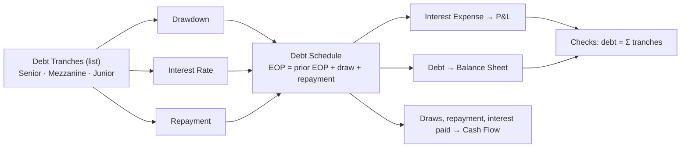

# 🏦 Tech M&A - LBO Deal Model

> A mid-market software buyout in one file: the operating case, the capital structure and the price conversation. Fork it, drop a target's real actuals into the historical years, and let the rest run off the drivers.

  

A B2B software target is acquired at the end of FY2026 for **$43.0M**, funded by a three tranche debt package. FY2024 to FY2026 are actuals plus entry; FY2027 and FY2028 are the management plan. The model carries the deal all the way through: the debt threads the P&L, the balance sheet and the cash flow, and the valuation block resolves into a football field.

Three live integrity monitors sit in a **Checks** section and stay green: the balance sheet balances, the ARR walk reconciles to the ARR stock, and the balance sheet debt ties to the debt schedule.

---

## P&L ($k)

| Line | FY2024 | FY2025 | FY2026 | FY2027 | FY2028 |
|---|--:|--:|--:|--:|--:|
| Revenue | 1,642 | 3,772 | 7,170 | 12,677 | 21,379 |
| Total COS | (275) | (603) | (1,121) | (1,951) | (3,258) |
| **Gross profit** | **1,367** | **3,169** | **6,049** | **10,726** | **18,121** |
| Gross margin | 83% | 84% | 84% | 85% | 85% |
| Operating expenses | (2,356) | (3,589) | (4,899) | (6,422) | (7,924) |
| **EBITDA** | **(989)** | **(420)** | **1,150** | **4,304** | **10,198** |
| EBITDA margin | (60%) | (11%) | 16% | 34% | 48% |
| Depreciation & amortisation | (33) | (43) | (49) | (56) | (64) |
| **EBIT** | **(1,022)** | **(463)** | **1,101** | **4,248** | **10,134** |
| Interest expense | 0 | 0 | 0 | (3,900) | (3,450) |
| **Profit before tax** | **(1,022)** | **(463)** | **1,101** | **348** | **6,684** |
| Income tax | 0 | 0 | (275) | (87) | (1,671) |
| **Net income** | **(1,022)** | **(463)** | **826** | **261** | **5,013** |

The tax shield is automatic: interest lands before tax, so FY2027 pays $87k on $348k of pre-tax profit instead of $1.1M on unlevered EBIT.

## Capital structure and deleveraging ($k)

| Line | FY2024 | FY2025 | FY2026 | FY2027 | FY2028 |
|---|--:|--:|--:|--:|--:|
| Debt (EOP, all tranches) | 0 | 0 | 43,000 | 38,000 | 33,000 |
| Interest | 0 | 0 | 0 | 3,900 | 3,450 |
| Cash | (339) | 2,816 | 5,044 | 2,124 | 6,732 |
| **Net debt** | 339 | (2,816) | 37,956 | 35,876 | 26,268 |
| **Net debt / EBITDA** | n/a | n/a | 33.0x | 8.3x | 2.6x |

Debt proceeds fund **Goodwill & Acquisitions** ($43.0M asset), so the draw is cash neutral at entry and does not inflate the cash line. Interest runs on the opening balance, which is why the draw year carries none.

## Valuation ($k)

| Line | FY2026 | FY2027 | FY2028 |
|---|--:|--:|--:|
| Enterprise value (revenue basis) | 57,362 | 101,415 | 171,031 |
| Net cash / (net debt) | (37,956) | (35,876) | (26,268) |
| **Equity value** | **19,406** | **65,538** | **144,763** |
| Implied EV / revenue | 8.0x | 8.0x | 8.0x |

**Football field at FY2028**: EV/Revenue $128.3M to $213.8M, EV/EBITDA $142.8M to $224.3M, EV on EBITDA at the base multiple $183.6M.

## Topline and efficiency

| Metric | FY2024 | FY2025 | FY2026 | FY2027 | FY2028 |
|---|--:|--:|--:|--:|--:|
| ARR ($k) | 1,571 | 3,672 | 7,040 | 12,527 | 21,209 |
| Closing customers | 73 | 144 | 253 | 417 | 657 |
| Net revenue retention | 100% | 100% | 98% | 98% | 98% |
| Gross revenue retention | 100% | 87% | 85% | 85% | 86% |
| Rule of 40 | n/a | 123% | 108% | 112% | 117% |
| Headcount | 9 | 15 | 21 | 27 | 30 |
| ARR per FTE ($k) | 175 | 245 | 335 | 464 | 707 |

---

## Debt is a list, so a tranche is one move

The capital structure lives in a **`Debt Tranches` list** with three list-mode assumptions: drawdown, rate, repayment. To add a financing line you add one element to the list and fill its three cells. Interest, the P&L, the balance sheet debt stock and the cash flow all extend on their own, and the checks stay green.

That is the structural move worth showing: **an assumption change goes in a branch and leaves the base intact; a structural change edits the model itself and propagates across every branch.**

## Balance sheet at FY2028 ($k)

| | FY2028 |
|---|--:|
| Total assets | 52,176 |
| Total liabilities | 43,961 |
| Total equity | 8,214 |
| **Balance check** | **0** |

Assets = liabilities + equity every single year, on the base and on any branch.

## Conventions

- **Currency**: USD. **Sign**: revenues positive, costs, D&A, tax and interest stored negative, so every subtotal is a simple sum.
- **Actuals boundary**: `actuals_through = 2026-12-31`. FY2024 to FY2026 are actuals plus entry, FY2027 and FY2028 are the plan (dashed on charts).
- **Headcount** uses the native list pattern: 30 employees mapped to 4 departments, department payroll deploys one column per department.

## Known simplifications

Interest on the **opening balance**, no cash sweep: amortisation is a scheduled driver. Debt proceeds sit in goodwill, so there is no full sources and uses and no MOIC or IRR waterfall. This is a levered operating and valuation model, not a returns model. For sources and uses, cash sweep and IRR, take the [LBO (Mid-Market Buyout)](../lbo/) instead.

## How to use it

1. **[Open it in Layerz](https://app.layerz.cc/models/3657668b-4684-4010-bd9b-c83845db1dff)** (free account) and **fork** it: you get a model you own.
2. Replace the historical years with the target's real numbers from the data room, and move `actuals_through` to your cutover.
3. Rebuild the capital structure by editing the `Debt Tranches` list. Add or remove a tranche, the schedule and the three statements follow.
4. Export to Excel any time. The export is clean and auditable.

---

*Part of [Finance Models](../../README.md). Built with [Layerz](https://layerz.cc). We share the recipe, not the black box.*
