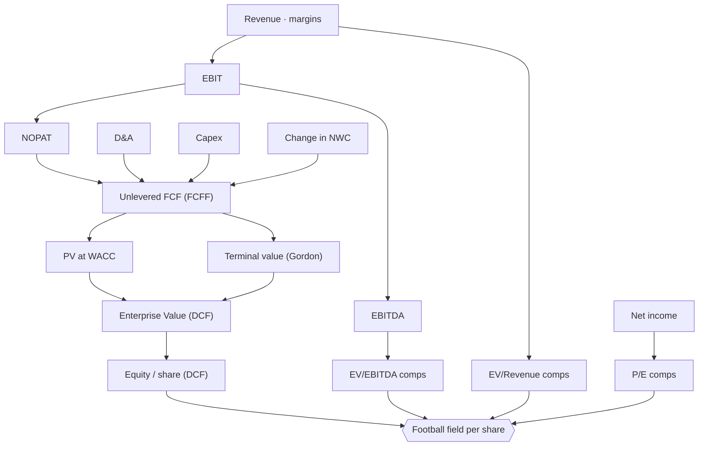

# ⚖️ Valuation - DCF and Multiples

> A company valuation done two ways and laid side by side: a 5-year unlevered DCF and trading comps (EV/EBITDA, EV/Revenue, P/E), resolved into a football field per share. Change a driver and the whole football field moves.

  

-555)

Change a driver (WACC, terminal growth, margins, the comp multiples) and every method reprices at once. 2025 is the current (LTM) year that drives the multiples; 2026 to 2030 is the explicit forecast that drives the DCF.

---

## Dashboard: at a glance

| | |
|---|---|
| **LTM revenue / EBITDA** | €180.0 m / €39.6 m |
| **WACC / terminal growth** | 9.0% / 2.5% |
| **Enterprise value (DCF)** | €520.7 m |
| **Equity value (DCF)** | €400.7 m |
| **DCF value per share** | €20.03 |
| **Blended value per share** | €15.61 |
| **Net debt / shares** | €120.0 m / 20.0 m |

---

## Football field (value per share, EUR)

| Method | Low | Mid | High |
|---|--:|--:|--:|
| DCF (unlevered FCFF) | | **20.03** | |
| EV / EBITDA (8x - 12x) | 9.84 | 13.80 | 17.76 |
| EV / Revenue (1.5x - 2.5x) | 7.50 | 12.00 | 16.50 |
| P / E (14x - 22x) | 12.92 | 16.61 | 20.30 |
| **Blended (DCF + mid comps)** | | **15.61** | |

The methods span roughly **€7.50 to €20.30** per share. Reading the spread is the point: the DCF prices in the forecast growth, the comps price the market's current view, and the blend lands at €15.61.

## The DCF (k€)

| | 2026 | 2027 | 2028 | 2029 | 2030 |
|---|--:|--:|--:|--:|--:|
| Revenue | 200,000 | 224,000 | 247,000 | 267,000 | 285,000 |
| Unlevered FCF | 22,000 | 26,080 | 31,130 | 36,383 | 39,338 |

Discounted at a 9% WACC, plus a Gordon-growth terminal value at 2.5%, gives an enterprise value of **520,680 k€**; less 120,000 k€ net debt, an equity value of **400,680 k€**, or **€20.03 per share**.

---

## Structure

## Conventions

- **Currency**: EUR thousands (k€); per-share values in EUR. **Sign**: revenues positive, costs negative.
- **Timeline**: yearly. 2025 is the LTM base (multiples); 2026-2030 is the explicit forecast (DCF). Valuation date = start of 2026.
- **Kept clean**: net debt and share count are single inputs; no full balance sheet. Fork it and wire your own build-up where the deal needs it.

Full conventions live in the model's `FINANCE.md`.

---

## How to use it

1. **[Open it in Layerz](https://layerz.cc/models/29f9cebe-cfc3-403b-82c4-bd50e1f8e042)** (free account) and **fork** it: you get a model you own.
2. Change the drivers in `Assumptions` (WACC, terminal growth, margins, the comp multiples low/mid/high, net debt, shares). The DCF, every multiple and the football field recompute at once.
3. Export to Excel any time. The export is clean and auditable.

---

*Part of [Finance Models](../../README.md). Built with [Layerz](https://layerz.cc). We share the recipe, not the black box.*
